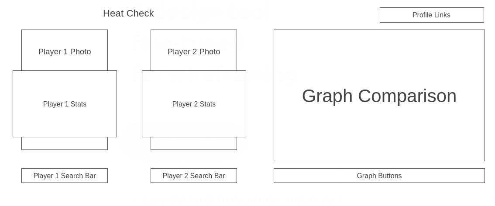

# Heat Check
Heat Check is a data visualization webpage where users can compare the top NBA players' stats.

# Functionality and MVPs
* Users can search for players
* Searched players' stats will display on main section and graph
* Graph buttons can be used to compare specific stats

# Wireframes

# Architechture and Technology
HTML5\
CSS3\
Vanilla JavaScript\
D3.js

# Implementation Timeline
Day 1 - Render basic layout of page/Research and experiment with d3.js and balldontlie api\
Day 2 - Search functionality for players\
Day 3 - Render players' stats on graph/graph button functionality
